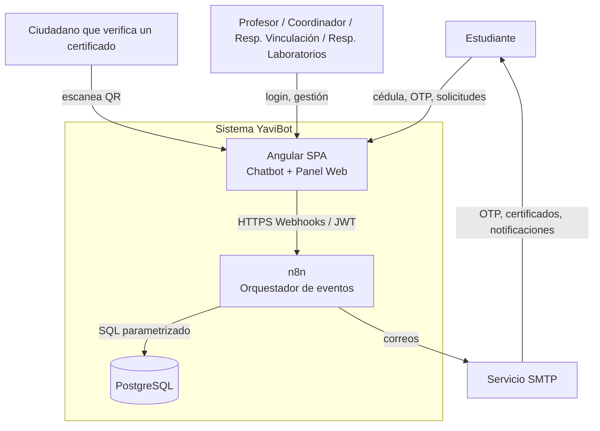
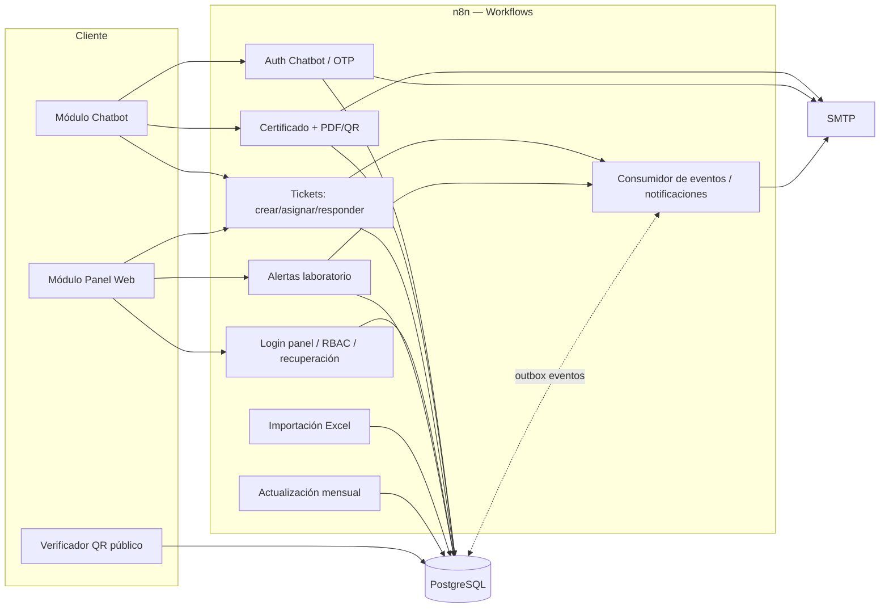
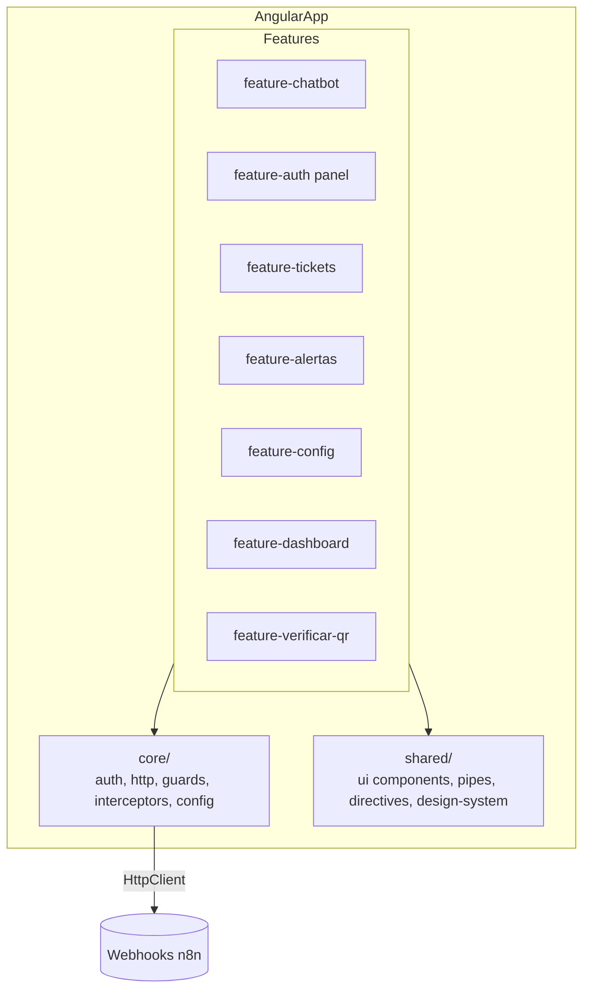
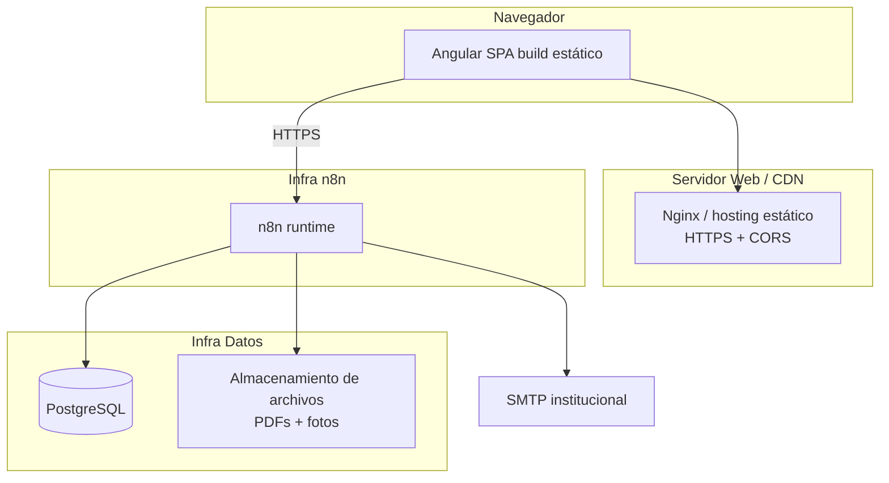

# 02 — Arquitectura Orientada a Eventos (EDA)

## 2.1 Principios

1. **Angular** solo presenta UI y llama webhooks HTTPS. No conoce PostgreSQL.
2. **n8n** es el motor: recibe peticiones (webhooks), valida, ejecuta lógica, publica eventos y accede a PostgreSQL con **consultas parametrizadas**.
3. **PostgreSQL** persiste datos + un **outbox de eventos** (`eventos`) que da trazabilidad y desacopla side-effects.
4. **SMTP** envía correos.
5. Toda acción importante **publica un evento** que puede activar uno o varios workflows.

### Patrón de eventos (n8n puro)
Como no hay un broker (Kafka/RabbitMQ), la EDA se implementa con:
- **Outbox `eventos`**: cada workflow que cambia estado inserta un registro de evento (tipo + payload + `procesado=false`).
- **Sub-workflows de n8n**: un workflow puede invocar a otro (`Execute Workflow`) al publicar un evento, y/o un workflow *scheduler* consume `eventos` pendientes. Esto simula pub/sub manteniendo desacoplamiento.

## 2.2 Diagrama de Contexto (C4 nivel 1)



## 2.3 Diagrama de Arquitectura (lógica)



## 2.4 Diagrama de Componentes (Angular)



## 2.5 Diagrama de Despliegue



## 2.6 Catálogo de eventos

| Evento | Origen | Payload (mínimo) | Consumidores (workflows) |
|--------|--------|------------------|--------------------------|
| `EstudianteValidado` | Auth chatbot | cedula, estudiante_id | Generación OTP |
| `EstudianteNoMatriculado` | Auth chatbot | cedula, estado | Auditoría |
| `OTPGenerado` | Auth chatbot | cedula, otp_id, expira_en | Envío OTP |
| `OTPEnviado` | Envío OTP | cedula, correo | Auditoría |
| `OTPValidado` | Auth chatbot | cedula, otp_id | Emisión sesión chat |
| `CertificadoSolicitado` | Chatbot | estudiante_id | Generación certificado |
| `QRGenerado` | Certificado | qr_id, identificador | Generación PDF |
| `CertificadoGenerado` | Certificado | certificado_id | Envío correo |
| `PDFGenerado` | Certificado | certificado_id, pdf_path | Envío correo |
| `CorreoEnviado` | Cualquiera | destinatario, tipo | Auditoría |
| `TicketCreado` | Chatbot/Alerta | ticket_id, tipo_solicitud | Asignación responsable |
| `TicketAsignado` | Asignación | ticket_id, responsable_id | Notificación |
| `TicketConsultado` | Chatbot | cedula | Auditoría |
| `TicketActualizado` | Panel | ticket_id, estado | Historial |
| `TicketRespondido` | Panel | ticket_id, respuesta | Correo al estudiante |
| `TicketResuelto` | Panel | ticket_id | Correo + estadísticas |
| `AlertaCreada` | Panel (profesor) | alerta_id | Crear ticket + asignar |
| `AlertaAsignada` | Asignación | alerta_id, responsable_id | Notificación |
| `AlertaActualizada` | Panel | alerta_id, estado | Historial |
| `ResponsableActualizado` | Config | tipo, anterior, nuevo | Auditoría |
| `UsuarioAutenticado` | Panel | usuario_id, rol | Auditoría |
| `ContraseñaRecuperada` | Panel | usuario_id | Auditoría |
| `EstadoMatriculaActualizado` | Actualización mensual | cedula, estado | Auditoría |
| `DashboardActualizado` | Estadísticas | métricas | UI |

Cada evento se inserta en la tabla `eventos` (outbox) y, cuando corresponde, dispara un `Execute Workflow` en n8n.

## 2.7 Integración Angular ↔ n8n ↔ PostgreSQL

**Flujo síncrono (request/response):**
```
Angular --HTTP POST /webhook/...--> n8n [Webhook node]
   n8n: valida JWT/OTP -> valida payload -> SQL parametrizado (Postgres node)
   n8n: inserta evento en outbox -> [Respond to Webhook node] --> Angular
```

**Flujo asíncrono (side-effects):**
```
Workflow A inserta evento en `eventos` -> Execute Workflow (B)
   B: envía correo / genera PDF / notifica -> marca evento procesado
```

**Contrato general:**
- Todas las respuestas usan sobre estándar: `{ ok: boolean, data?: any, error?: { code, message } }` (ver doc 07).
- Angular añade `Authorization: Bearer <JWT>` (panel) o `X-Chat-Session: <token>` (chatbot) en cada llamada protegida.
- CORS restringido al origen del SPA. HTTPS obligatorio.

## 2.8 Justificación técnica

- El **outbox de eventos** da trazabilidad (RNF-07) y desacopla side-effects (RNF-03) sin necesidad de un broker externo, apropiado para el alcance académico.
- La **asignación por datos** (`asignaciones_responsables`) cumple RN-08/RNF-04: cambiar autoridades = actualizar filas, sin tocar workflows ni código.
- Mantener a **Angular sin acceso a BD** cumple el desacoplamiento exigido y reduce superficie de ataque.
- **Riesgo asumido (n8n puro):** auth/RBAC/validación viven en nodos de n8n; se mitiga con un sub-workflow reutilizable `guard-jwt` y `guard-rbac` invocado al inicio de cada webhook protegido (ver doc 05).
