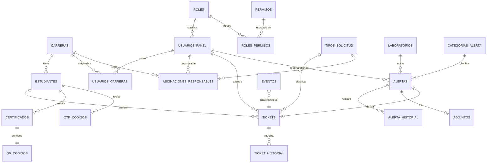

# 03 — Modelo de Datos (PostgreSQL, 3FN)

## 3.1 Modelo Entidad-Relación (MER)



## 3.2 Modelo Relacional (resumen de tablas)

- `carreras(id PK, codigo UK, nombre)`
- `roles(id PK, codigo UK, nombre, descripcion)`
- `permisos(id PK, codigo UK, descripcion)`
- `roles_permisos(rol_id FK, permiso_id FK, PK compuesta)`
- `usuarios_panel(id PK, cedula UK, nombres, correo UK, password_hash, rol_id FK, activo, ...)`
- `usuarios_carreras(usuario_id FK, carrera_id FK, PK compuesta)`
- `estudiantes(id PK, cedula UK, nombres, carrera_id FK, nivel, paralelo, estado_matricula, correo UK, ...)`
- `tipos_solicitud(id PK, codigo UK, nombre, genera_ticket, ambito)`
- `asignaciones_responsables(id PK, tipo_solicitud_id FK, carrera_id FK NULL, usuario_id FK, vigente, semestre, ...)`
- `tickets(id PK, codigo UK, tipo_solicitud_id FK, estudiante_id FK, carrera_id FK, nivel, paralelo, descripcion, estado, responsable_id FK NULL, ...)`
- `ticket_historial(id PK, ticket_id FK, estado_anterior, estado_nuevo, respuesta, usuario_id FK NULL, creado_en)`
- `certificados(id PK, estudiante_id FK, tipo, qr_id FK UK, pdf_path, fecha, hora, ...)`
- `qr_codigos(id PK, identificador UK, estudiante_id FK, certificado_id FK NULL, payload, verificaciones, ...)`
- `otp_codigos(id PK, cedula, correo, codigo_hash, canal, expira_en, usado, ...)`
- `intentos_acceso(id PK, cedula, canal, intentos_fallidos, bloqueado_hasta, ...)`
- `laboratorios(id PK, codigo UK, nombre, ubicacion)`
- `categorias_alerta(id PK, nombre UK)`
- `adjuntos(id PK, tipo, ruta, mime, tamano_bytes, hash, ...)`
- `alertas(id PK, codigo UK, laboratorio_id FK, categoria_id FK, descripcion, adjunto_id FK NULL, profesor_id FK, estado, responsable_id FK NULL, ticket_id FK NULL, ...)`
- `alerta_historial(id PK, alerta_id FK, estado_anterior, estado_nuevo, observacion, usuario_id FK, creado_en)`
- `eventos(id PK, tipo, payload JSONB, origen, procesado, creado_en)`
- `auditoria(id PK, usuario_tipo, usuario_ref, accion, entidad, entidad_id, resultado, ip, creado_en, detalle JSONB)`
- `importaciones(id PK, tipo, archivo, insertados, actualizados, omitidos, errores JSONB, usuario_ref, creado_en)`
- `configuracion_sistema(id PK, clave UK, valor, descripcion, actualizado_por, actualizado_en)`

## 3.3 Diccionario de datos (tablas clave)

### `periodos_academicos`
> Añadida a partir del análisis del formato real del Certificado de Matrícula (ver `database/05-migracion-certificado.sql`). El certificado oficial imprime el periodo lectivo vigente (código + rango de fechas) y el periodo en que el estudiante inició sus estudios — ninguno de los dos existía en el diseño original.

| Campo | Tipo | Restricción | Descripción |
|-------|------|-------------|-------------|
| id | BIGSERIAL | PK | |
| codigo | VARCHAR(10) | UNIQUE, NOT NULL | `2026-I`, `2025-II` |
| nombre | VARCHAR(60) | NOT NULL | `mayo-septiembre 2026` |
| fecha_inicio / fecha_fin | DATE | NOT NULL | Rango del ciclo lectivo |
| vigente | BOOLEAN | default false | Solo un periodo vigente a la vez (índice único parcial) |

### `estudiantes`
| Campo | Tipo | Restricción | Descripción |
|-------|------|-------------|-------------|
| id | BIGSERIAL | PK | Identificador |
| cedula | VARCHAR(10) | UNIQUE, NOT NULL, CHECK 10 dígitos | Clave natural |
| nombres | VARCHAR(150) | NOT NULL | Nombres completos |
| carrera_id | BIGINT | FK carreras | Carrera |
| nivel | VARCHAR(30) | NOT NULL | Nivel/semestre |
| paralelo | VARCHAR(5) | NOT NULL | Paralelo |
| estado_matricula | VARCHAR(20) | NOT NULL, CHECK | ACTIVA/INACTIVA/RETIRADA/SUSPENDIDA |
| correo | VARCHAR(150) | UNIQUE, NOT NULL, CHECK email | Correo institucional |
| **modalidad** | VARCHAR(20) | NOT NULL, CHECK, default `Presencial` | Presencial/Dual/En línea/Semipresencial — aparece en el certificado ("modalidad dual") |
| **periodo_ingreso_id** | BIGINT | FK periodos_academicos | En qué ciclo lectivo inició sus estudios (distinto del nivel actual) |
| **nivel_ingreso** | VARCHAR(30) | NOT NULL, default `Primer nivel` | Nivel con el que ingresó a la institución |
| creado_en / actualizado_en | TIMESTAMPTZ | default now() | Auditoría temporal |

### `tickets`
| Campo | Tipo | Restricción | Descripción |
|-------|------|-------------|-------------|
| id | BIGSERIAL | PK | |
| codigo | VARCHAR(15) | UNIQUE, NOT NULL | TK-000001 |
| tipo_solicitud_id | BIGINT | FK, NOT NULL | |
| estudiante_id | BIGINT | FK, NOT NULL | |
| carrera_id | BIGINT | FK | Snapshot al crear |
| nivel / paralelo | VARCHAR | | Snapshot al crear |
| descripcion | TEXT | NULL | |
| estado | VARCHAR(15) | CHECK (Pendiente/En Proceso/Resuelto) | |
| responsable_id | BIGINT | FK usuarios_panel NULL | Asignado |
| creado_en / actualizado_en | TIMESTAMPTZ | | |

### `asignaciones_responsables`
| Campo | Tipo | Restricción | Descripción |
|-------|------|-------------|-------------|
| id | BIGSERIAL | PK | |
| tipo_solicitud_id | BIGINT | FK, NOT NULL | Regla por tipo |
| carrera_id | BIGINT | FK, NULL | Si aplica por carrera (Récord/Anulación) |
| usuario_id | BIGINT | FK usuarios_panel | Responsable vigente |
| vigente | BOOLEAN | default true | |
| semestre | VARCHAR(20) | | p.ej. 2026-1 |
| UNIQUE parcial | | (tipo_solicitud_id, carrera_id) WHERE vigente | Una regla vigente por combinación |

### `otp_codigos`
| Campo | Tipo | Restricción | Descripción |
|-------|------|-------------|-------------|
| id | BIGSERIAL | PK | |
| cedula | VARCHAR(10) | NOT NULL, INDEX | |
| correo | VARCHAR(150) | | Destino |
| codigo_hash | VARCHAR(255) | NOT NULL | Hash del OTP (no en claro) |
| canal | VARCHAR(20) | CHECK (chatbot/panel_recovery) | |
| expira_en | TIMESTAMPTZ | NOT NULL | |
| usado | BOOLEAN | default false | Un solo uso |
| creado_en | TIMESTAMPTZ | default now() | Historial |

## 3.4 DDL PostgreSQL (esquema propuesto)

```sql
-- =====================================================================
-- YaviBot — Esquema PostgreSQL (3FN). Ejecutar en orden.
-- =====================================================================

CREATE TABLE carreras (
  id          BIGGENERATED ALWAYS AS IDENTITY PRIMARY KEY,
  codigo      VARCHAR(20)  NOT NULL UNIQUE,
  nombre      VARCHAR(150) NOT NULL
);
-- (nota: reemplazar BIGGENERATED por 'BIGINT GENERATED ALWAYS AS IDENTITY')

CREATE TABLE roles (
  id          BIGINT GENERATED ALWAYS AS IDENTITY PRIMARY KEY,
  codigo      VARCHAR(40)  NOT NULL UNIQUE,   -- PROFESOR, COORDINADOR, RESP_VINCULACION, RESP_LABORATORIOS
  nombre      VARCHAR(80)  NOT NULL,
  descripcion VARCHAR(200)
);

CREATE TABLE permisos (
  id          BIGINT GENERATED ALWAYS AS IDENTITY PRIMARY KEY,
  codigo      VARCHAR(60)  NOT NULL UNIQUE,   -- ticket.ver, ticket.responder, alerta.crear, config.responsables, ...
  descripcion VARCHAR(200)
);

CREATE TABLE roles_permisos (
  rol_id     BIGINT NOT NULL REFERENCES roles(id) ON DELETE CASCADE,
  permiso_id BIGINT NOT NULL REFERENCES permisos(id) ON DELETE CASCADE,
  PRIMARY KEY (rol_id, permiso_id)
);

CREATE TABLE usuarios_panel (
  id            BIGINT GENERATED ALWAYS AS IDENTITY PRIMARY KEY,
  cedula        VARCHAR(10)  NOT NULL UNIQUE CHECK (cedula ~ '^[0-9]{10}$'),
  nombres       VARCHAR(150) NOT NULL,
  correo        VARCHAR(150) NOT NULL UNIQUE,
  password_hash VARCHAR(255) NOT NULL,        -- bcrypt
  rol_id        BIGINT NOT NULL REFERENCES roles(id),
  activo        BOOLEAN NOT NULL DEFAULT TRUE,
  creado_en     TIMESTAMPTZ NOT NULL DEFAULT now(),
  actualizado_en TIMESTAMPTZ NOT NULL DEFAULT now()
);

CREATE TABLE usuarios_carreras (
  usuario_id BIGINT NOT NULL REFERENCES usuarios_panel(id) ON DELETE CASCADE,
  carrera_id BIGINT NOT NULL REFERENCES carreras(id) ON DELETE CASCADE,
  PRIMARY KEY (usuario_id, carrera_id)
);

CREATE TABLE estudiantes (
  id             BIGINT GENERATED ALWAYS AS IDENTITY PRIMARY KEY,
  cedula         VARCHAR(10)  NOT NULL UNIQUE CHECK (cedula ~ '^[0-9]{10}$'),
  nombres        VARCHAR(150) NOT NULL,
  carrera_id     BIGINT NOT NULL REFERENCES carreras(id),
  nivel          VARCHAR(30)  NOT NULL,
  paralelo       VARCHAR(5)   NOT NULL,
  estado_matricula VARCHAR(20) NOT NULL
      CHECK (estado_matricula IN ('ACTIVA','INACTIVA','RETIRADA','SUSPENDIDA')),
  correo         VARCHAR(150) NOT NULL UNIQUE,
  creado_en      TIMESTAMPTZ NOT NULL DEFAULT now(),
  actualizado_en TIMESTAMPTZ NOT NULL DEFAULT now()
);
CREATE INDEX ix_estudiantes_estado ON estudiantes(estado_matricula);

CREATE TABLE tipos_solicitud (
  id            BIGINT GENERATED ALWAYS AS IDENTITY PRIMARY KEY,
  codigo        VARCHAR(40) NOT NULL UNIQUE,  -- CERT_MATRICULA, RECORD_ACADEMICO, CERT_VINCULACION, ANULACION_MATRICULA, ALERTA_LAB
  nombre        VARCHAR(100) NOT NULL,
  genera_ticket BOOLEAN NOT NULL,
  ambito        VARCHAR(20) NOT NULL CHECK (ambito IN ('carrera','vinculacion','laboratorio','ninguno'))
);

CREATE TABLE asignaciones_responsables (
  id                BIGINT GENERATED ALWAYS AS IDENTITY PRIMARY KEY,
  tipo_solicitud_id BIGINT NOT NULL REFERENCES tipos_solicitud(id),
  carrera_id        BIGINT NULL REFERENCES carreras(id),
  usuario_id        BIGINT NOT NULL REFERENCES usuarios_panel(id),
  vigente           BOOLEAN NOT NULL DEFAULT TRUE,
  semestre          VARCHAR(20),
  creado_en         TIMESTAMPTZ NOT NULL DEFAULT now()
);
-- Una sola regla vigente por (tipo, carrera). carrera NULL se trata como -1 vía índice funcional.
CREATE UNIQUE INDEX ux_asignacion_vigente
  ON asignaciones_responsables (tipo_solicitud_id, COALESCE(carrera_id, -1))
  WHERE vigente;

CREATE TABLE tickets (
  id                BIGINT GENERATED ALWAYS AS IDENTITY PRIMARY KEY,
  codigo            VARCHAR(15) NOT NULL UNIQUE,
  tipo_solicitud_id BIGINT NOT NULL REFERENCES tipos_solicitud(id),
  estudiante_id     BIGINT NOT NULL REFERENCES estudiantes(id),
  carrera_id        BIGINT NOT NULL REFERENCES carreras(id),
  nivel             VARCHAR(30) NOT NULL,
  paralelo          VARCHAR(5)  NOT NULL,
  descripcion       TEXT,
  estado            VARCHAR(15) NOT NULL DEFAULT 'Pendiente'
      CHECK (estado IN ('Pendiente','En Proceso','Resuelto')),
  responsable_id    BIGINT REFERENCES usuarios_panel(id),
  creado_en         TIMESTAMPTZ NOT NULL DEFAULT now(),
  actualizado_en    TIMESTAMPTZ NOT NULL DEFAULT now()
);
CREATE INDEX ix_tickets_estado ON tickets(estado);
CREATE INDEX ix_tickets_responsable ON tickets(responsable_id);
CREATE INDEX ix_tickets_estudiante ON tickets(estudiante_id);

CREATE TABLE ticket_historial (
  id              BIGINT GENERATED ALWAYS AS IDENTITY PRIMARY KEY,
  ticket_id       BIGINT NOT NULL REFERENCES tickets(id) ON DELETE CASCADE,
  estado_anterior VARCHAR(15),
  estado_nuevo    VARCHAR(15) NOT NULL,
  respuesta       TEXT,
  usuario_id      BIGINT REFERENCES usuarios_panel(id),
  creado_en       TIMESTAMPTZ NOT NULL DEFAULT now()
);

CREATE TABLE qr_codigos (
  id             BIGINT GENERATED ALWAYS AS IDENTITY PRIMARY KEY,
  identificador  UUID NOT NULL UNIQUE DEFAULT gen_random_uuid(),
  estudiante_id  BIGINT NOT NULL REFERENCES estudiantes(id),
  certificado_id BIGINT,  -- FK diferida abajo
  payload        JSONB NOT NULL,
  verificaciones INT NOT NULL DEFAULT 0,
  creado_en      TIMESTAMPTZ NOT NULL DEFAULT now()
);

CREATE TABLE certificados (
  id            BIGINT GENERATED ALWAYS AS IDENTITY PRIMARY KEY,
  estudiante_id BIGINT NOT NULL REFERENCES estudiantes(id),
  tipo          VARCHAR(40) NOT NULL DEFAULT 'CERT_MATRICULA',
  qr_id         BIGINT NOT NULL UNIQUE REFERENCES qr_codigos(id),
  pdf_path      VARCHAR(300),
  fecha         DATE NOT NULL DEFAULT current_date,
  hora          TIME NOT NULL DEFAULT current_time,
  creado_en     TIMESTAMPTZ NOT NULL DEFAULT now()
);
ALTER TABLE qr_codigos
  ADD CONSTRAINT fk_qr_certificado FOREIGN KEY (certificado_id) REFERENCES certificados(id);

CREATE TABLE otp_codigos (
  id         BIGINT GENERATED ALWAYS AS IDENTITY PRIMARY KEY,
  cedula     VARCHAR(10) NOT NULL,
  correo     VARCHAR(150),
  codigo_hash VARCHAR(255) NOT NULL,
  canal      VARCHAR(20) NOT NULL CHECK (canal IN ('chatbot','panel_recovery')),
  expira_en  TIMESTAMPTZ NOT NULL,
  usado      BOOLEAN NOT NULL DEFAULT FALSE,
  creado_en  TIMESTAMPTZ NOT NULL DEFAULT now()
);
CREATE INDEX ix_otp_cedula ON otp_codigos(cedula, canal);

CREATE TABLE intentos_acceso (
  id                BIGINT GENERATED ALWAYS AS IDENTITY PRIMARY KEY,
  cedula            VARCHAR(10) NOT NULL,
  canal             VARCHAR(20) NOT NULL,
  intentos_fallidos INT NOT NULL DEFAULT 0,
  bloqueado_hasta   TIMESTAMPTZ,
  actualizado_en    TIMESTAMPTZ NOT NULL DEFAULT now(),
  UNIQUE (cedula, canal)
);

CREATE TABLE laboratorios (
  id        BIGINT GENERATED ALWAYS AS IDENTITY PRIMARY KEY,
  codigo    VARCHAR(20) NOT NULL UNIQUE,
  nombre    VARCHAR(100) NOT NULL,
  ubicacion VARCHAR(150)
);

CREATE TABLE categorias_alerta (
  id     BIGINT GENERATED ALWAYS AS IDENTITY PRIMARY KEY,
  nombre VARCHAR(80) NOT NULL UNIQUE
);

CREATE TABLE adjuntos (
  id          BIGINT GENERATED ALWAYS AS IDENTITY PRIMARY KEY,
  tipo        VARCHAR(30) NOT NULL,        -- foto_alerta
  ruta        VARCHAR(300) NOT NULL,
  mime        VARCHAR(60) NOT NULL CHECK (mime IN ('image/jpeg','image/png')),
  tamano_bytes INT NOT NULL CHECK (tamano_bytes <= 5242880),  -- 5 MB
  hash        VARCHAR(64),
  creado_en   TIMESTAMPTZ NOT NULL DEFAULT now()
);

CREATE TABLE alertas (
  id            BIGINT GENERATED ALWAYS AS IDENTITY PRIMARY KEY,
  codigo        VARCHAR(15) NOT NULL UNIQUE,
  laboratorio_id BIGINT NOT NULL REFERENCES laboratorios(id),
  categoria_id  BIGINT NOT NULL REFERENCES categorias_alerta(id),
  descripcion   TEXT NOT NULL,
  adjunto_id    BIGINT REFERENCES adjuntos(id),
  profesor_id   BIGINT NOT NULL REFERENCES usuarios_panel(id),
  estado        VARCHAR(15) NOT NULL DEFAULT 'Pendiente'
      CHECK (estado IN ('Pendiente','En revisión','Resuelta')),
  responsable_id BIGINT REFERENCES usuarios_panel(id),
  ticket_id     BIGINT REFERENCES tickets(id),
  creado_en     TIMESTAMPTZ NOT NULL DEFAULT now(),
  actualizado_en TIMESTAMPTZ NOT NULL DEFAULT now()
);

CREATE TABLE alerta_historial (
  id              BIGINT GENERATED ALWAYS AS IDENTITY PRIMARY KEY,
  alerta_id       BIGINT NOT NULL REFERENCES alertas(id) ON DELETE CASCADE,
  estado_anterior VARCHAR(15),
  estado_nuevo    VARCHAR(15) NOT NULL,
  observacion     TEXT,
  usuario_id      BIGINT REFERENCES usuarios_panel(id),
  creado_en       TIMESTAMPTZ NOT NULL DEFAULT now()
);

CREATE TABLE eventos (
  id        BIGINT GENERATED ALWAYS AS IDENTITY PRIMARY KEY,
  tipo      VARCHAR(50) NOT NULL,
  payload   JSONB NOT NULL DEFAULT '{}',
  origen    VARCHAR(50),
  procesado BOOLEAN NOT NULL DEFAULT FALSE,
  creado_en TIMESTAMPTZ NOT NULL DEFAULT now()
);
CREATE INDEX ix_eventos_pendientes ON eventos(procesado) WHERE NOT procesado;

CREATE TABLE auditoria (
  id          BIGINT GENERATED ALWAYS AS IDENTITY PRIMARY KEY,
  usuario_tipo VARCHAR(20),               -- estudiante / panel / sistema
  usuario_ref VARCHAR(50),                -- cedula o id
  accion      VARCHAR(80) NOT NULL,
  entidad     VARCHAR(50),
  entidad_id  VARCHAR(50),
  resultado   VARCHAR(20) NOT NULL,       -- exito / error
  ip          VARCHAR(45),
  detalle     JSONB,
  creado_en   TIMESTAMPTZ NOT NULL DEFAULT now()
);
CREATE INDEX ix_auditoria_fecha ON auditoria(creado_en);

CREATE TABLE importaciones (
  id           BIGINT GENERATED ALWAYS AS IDENTITY PRIMARY KEY,
  tipo         VARCHAR(20) NOT NULL CHECK (tipo IN ('estudiantes','profesores')),
  archivo      VARCHAR(200),
  insertados   INT NOT NULL DEFAULT 0,
  actualizados INT NOT NULL DEFAULT 0,
  omitidos     INT NOT NULL DEFAULT 0,
  errores      JSONB,
  usuario_ref  VARCHAR(50),
  creado_en    TIMESTAMPTZ NOT NULL DEFAULT now()
);

CREATE TABLE configuracion_sistema (
  id             BIGINT GENERATED ALWAYS AS IDENTITY PRIMARY KEY,
  clave          VARCHAR(60) NOT NULL UNIQUE,
  valor          VARCHAR(200) NOT NULL,
  descripcion    VARCHAR(200),
  actualizado_por VARCHAR(50),
  actualizado_en TIMESTAMPTZ NOT NULL DEFAULT now()
);
```

> Corrección: en `carreras` usar `BIGINT GENERATED ALWAYS AS IDENTITY` (el placeholder `BIGGENERATED` es solo ilustrativo y se corrige en el script real).

## 3.5 Configuración inicial sugerida (`configuracion_sistema`)

| clave | valor (def.) | descripción |
|-------|--------------|-------------|
| `otp.longitud` | `5` | Dígitos del OTP |
| `otp.expiracion_min` | `5` | Minutos de validez |
| `otp.max_intentos` | `5` | Intentos antes de bloqueo |
| `otp.bloqueo_min` | `15` | Minutos de bloqueo |
| `jwt.duracion_min` | `60` | Vida del token del panel |
| `imagen.max_mb` | `5` | Tamaño máx. de foto de alerta |
| `institucion.nombre_oficial` | `Instituto Superior Tecnológico de Turismo y Patrimonio "YAVIRAC"` | Razón social completa (membrete del certificado) |
| `institucion.direccion` | `García Moreno S4-35 y Ambato, Centro Histórico. Quito-Ecuador` | Dirección física institucional |
| `institucion.sitio_web` | `www.yavirac.edu.ec` | Sitio web institucional |
| `institucion.eslogan` | `¡Fortaleciendo Capacidades!` | Eslogan institucional |
| `institucion.ciudad_emision` | `Quito` | Ciudad en la frase "Se emite este certificado en..." |
| `firma.nombre` | `Mtr. Alexandra Gordon M.` | Quién firma los certificados generados |
| `firma.cargo` | `Secretaria General (s)` | Cargo de quien firma |

### Snapshot en `certificados`
Además de los campos originales, `certificados` guarda una copia (snapshot) de los datos impresos en el momento de la emisión: `periodo_lectivo_codigo`, `periodo_lectivo_nombre`, `modalidad`, `periodo_ingreso_codigo`, `periodo_ingreso_nombre`, `nivel_ingreso`, `firmante_nombre`, `firmante_cargo`. Mismo patrón que el snapshot de carrera/nivel/paralelo en `tickets`: si después cambia el periodo vigente o la autoridad firmante, los certificados ya emitidos no se alteran retroactivamente.

## 3.6 Justificación de entidades

- **`asignaciones_responsables`** (recomendación del prompt): desacopla "quién atiende qué" del código; cambio de autoridades = actualizar filas (RN-08, RNF-04).
- **`qr_codigos` separada de `certificados`**: cumple RN-04 (cada solicitud = QR nuevo) y habilita verificación pública (CU-11) sin exponer el certificado.
- **`eventos` (outbox)**: soporte de EDA sin broker externo (doc 02).
- **`intentos_acceso`**: soporta bloqueo temporal por cédula/canal (RN-03) sin recalcular sobre `otp_codigos`.
- **Snapshots** de `carrera_id/nivel/paralelo` en `tickets`: preserva integridad histórica si el estudiante cambia de nivel después.
